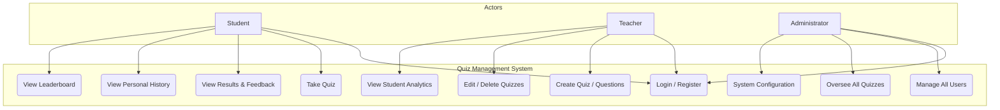
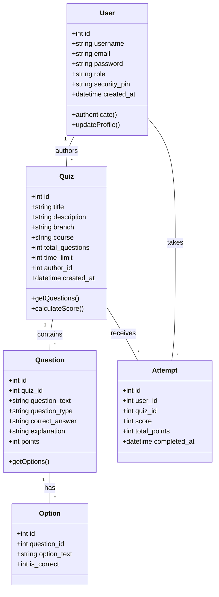

# Quiz Management System - Project Report

## 1. System Overview
The Quiz Management System is a web-based application designed to facilitate online assessments. It provides role-based access for Students, Teachers, and Administrators, allowing for a complete lifecycle of quiz creation, participation, and performance analysis.

---

## 2. Existing System Analysis
In current real-life educational and organizational settings, the process of conducting assessments is typically handled through traditional manual methods or through basic, non-specialized digital platforms.

### 2.1 Manual (Paper-Based) System
In many classrooms, the assessment workflow is almost entirely manual, involving significant effort from both students and teachers:

*   **Teacher Workflow (The "Manual Strain"):**
    *   **Preparation**: Teachers spend hours manually typing questions in word processors, ensuring proper formatting for printing.
    *   **Physical Logistics**: Printing hundreds of sheets, stapling them, and manually transporting them to the examination hall.
    *   **Grading with "Red Pen"**: After collection, teachers must manually read each answer, compare it to a reference key, and calculate totals. For 50+ students, this can take several days.
    *   **Recording**: Results are manually entered into physical ledger books or simple Excel sheets, which is prone to data entry errors.

*   **Student Workflow:**
    *   **Physical Presence**: Students must be physically present at a specific time and place.
    *   **Delayed Feedback**: Students often wait 1-2 weeks to see their grades, missing the opportunity for immediate learning and correction.
    *   **Limited Review**: Once papers are graded and returned, students often lose them or fail to analyze where they went wrong.

### 2.2 Existing Digital Platforms (Generic Forms)
Some organizations use generic platforms like **Google Forms** or **Microsoft Forms**. While they digitize the questions, they present several "real-life" hurdles:
*   **Separation of Data**: Results are often stored in a CSV/Excel file on a drive, making it hard to track a student's performance over an entire semester in one place.
*   **Lack of Hierarchy**: These platforms don't distinguish between a "Teacher" who creates the content and an "Admin" who manages the system, leading to security risks.
*   **The "One-Off" Nature**: Generic forms are often treated as isolated events rather than part of a continuous learning journey with a centralized dashboard.

### 2.3 The Core Problem
The main problem is **fragmentation**. Data is scattered across papers, emails, and spreadsheet files. There is no "single source of truth" for academic progress, which leads to administrative burnout for teachers and a lack of clear performance visibility for students.

---

## 3. Proposed Solution
The Quiz Management System addresses these issues by automating the grading process, providing instant results, and centralizing all academic data into a single, secure web application.

---

## 4. Use Case Diagram
The following diagram illustrates the interaction between different user roles and the system's core features.

---

## 5. Class Diagram
The class diagram below represents the structural model of the system, showing the main entities and their relationships.

---

## 6. Key Features
- **Multi-Role Authentication**: Secure login for Students, Teachers, and Admins.
- **Dynamic Quiz Creation**: Supports Multiple Choice, True/False, and Short Answer questions.
- **Real-time Evaluation**: Automated grading and immediate feedback.
- **Performance Analytics**: Detailed history and leaderboard for competitive learning.
- **Responsive Design**: Clean and premium UI across all devices.
