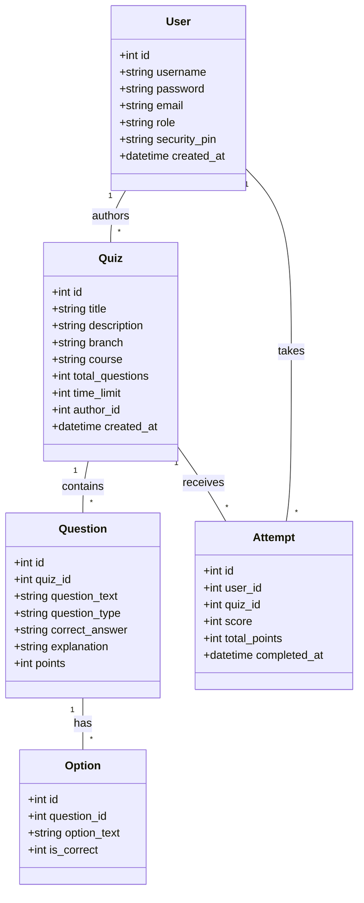

# QuizMaster Pro - Project Report

## 1. System Overview
QuizMaster Pro is a sophisticated web-based assessment platform designed to modernize the educational testing process. It provides role-based access for Students, Teachers, and Administrators, allowing for a complete lifecycle of quiz creation, participation, and performance analysis.

---

## 2. Introduction
QuizMaster Pro is a sophisticated web-based assessment platform designed to modernize the educational testing process. It streamlines quiz creation for educators and provides an immersive, high-performance environment for students. The system automates grading, offers instant feedback with explanations, and provides deep analytical insights into student progress.

---

## 3. Existing System Analysis
Traditional quiz methods often rely on paper-based exams or basic digital forms which suffer from:
- **Manual Grading**: High workload for teachers.
- **Delayed Results**: Students wait days for feedback.
- **Lack of Persistence**: Hard to track historical performance.
- **Static Content**: Limited to simple text questions without dynamic interaction.

---

## 4. Problem Statement
The manual approach to quizzes is:
- **Inefficient**: Time-consuming evaluation.
- **Error-Prone**: Human mistakes in scoring.
- **Scalability Issues**: Difficult to manage 100+ students simultaneously.
- **Engagement Gap**: Students lose interest without immediate feedback.

---

## 5. Proposed Solution
QuizMaster Pro addresses these issues by:
- **Automated Grading**: Instant calculation of MCQ, T/F, and exact-match Short Answers.
- **Smart Timers**: Features both an overall quiz timer and a **1-minute per question limit** to ensure consistent pacing.
- **Progressive Levels**: Organized into 20-question sections (levels). Passing a level unlocks the next challenge in the sequence.
- **Role-Based Dashboards**: Optimized views for Admin, Teacher, and Student.
- **Performance Analytics**: Visualizing trends and score distributions.
- **Secure Recovery**: Using a unique 4-digit Security PIN for password resets.

---

## 6. Actors & Roles

### 👤 Admin
- Full system oversight.
- User management (deleting/managing accounts).
- Access to global system statistics.
- Can create and edit any quiz content.

### 👨‍🏫 Teacher
- Create and manage personalized quizzes.
- Access the Question Editor to add MCQ, T/F, and Short Answer questions.
- View detailed Analytics for their own quizzes (Student performance trends).

### 🎓 Student
- Self-registration with branch selection.
- Attempt quizzes within time limits.
- View Personal History and detailed results with teacher explanations.
- Participate in the Global Leaderboard.

### Use Case Diagram

---

## 7. Functional Requirements
- **Authentication**: Secure Login/Sign-up with Access Codes for elevated roles.
- **Quiz Engine**: Timer-based execution with progress tracking.
- **Smart Feedback**: Explanations shown immediately after answers (or at results).
- **Editor**: Drag-and-drop style interface for managing question banks.
- **Leaderboard**: Dynamic ranking based on cumulative scores.
- **Analytics**: Teacher-specific charts and performance logs.

---

## 8. Technical Architecture

### Frontend (The UI/UX)
- **Glassmorphism Design**: Using CSS backdrops and translucent cards.
- **Responsive Layout**: Optimized for Mobile, Tablet, and Desktop.
- **Micro-animations**: Smooth transitions between quiz questions.

### Backend (The Logic)
- **PHP PDO**: Secure, prepared statements to prevent SQL Injection.
- **Session Management**: Secure role-based session handling.
- **Logic Layer**: Conditional routing based on role and user_id.

### Database (The Storage)
- **SQLite**: Lightweight, file-based relational database.
- **Foreign Keys**: Enabled ON DELETE CASCADE for data integrity.

---

## 9. Database Design (Schema)
The database structure is optimized for high-performance relational queries.

- **users**: `id`, `username`, `email`, `password`, `role`, `security_pin`, `created_at`
- **quizzes**: `id`, `title`, `description`, `branch`, `course`, `time_limit`, `author_id`
- **questions**: `id`, `quiz_id`, `question_text`, `question_type`, `points`, `correct_answer`, `explanation`
- **options**: `id`, `question_id`, `option_text`, `is_correct`
- **attempts**: `id`, `user_id`, `quiz_id`, `score`, `total_points`, `completed_at`

### Class Diagram

---

## 10. Navigation Logic
- **Entry**: `index.php` → `login.php`
- **Dashboard**: Role-specific routing (student-dashboard, teacher-dashboard, admin-dashboard).
- **Flow**:
    - **Teacher**: Dashboard → Create Quiz → Editor → Analytics.
    - **Student**: Dashboard → Branch Filter → Take Quiz → Results → History.
- **Safety**: All internal pages protected by session checks.

---

## 11. Security & Constraints
- **Validation**: Server-side validation for all form inputs.
- **PIN Recovery**: Security PIN required for account recovery.
- **Access Codes**: Hardcoded authorization codes for Teacher (**TEACHER2024**) and Admin (**ADMIN2024**) registration.
- **Auto-Submit**: Quizzes auto-submit when the timer reaches zero.

---

## 12. Conclusion
QuizMaster Pro successfully bridges the gap between traditional testing and modern e-learning. Its robust architecture and premium aesthetics provide a professional environment for both educators and students, ensuring that assessments are fair, fast, and insightful.

---

## 13. Deliverables
- Full Source Code (PHP, CSS, JS)
- SQLite Database File (`quiz.db`)
- Setup Scripts (`init_db.php`, `seed_data.php`)
- Documentation & User Guide (This Report)
